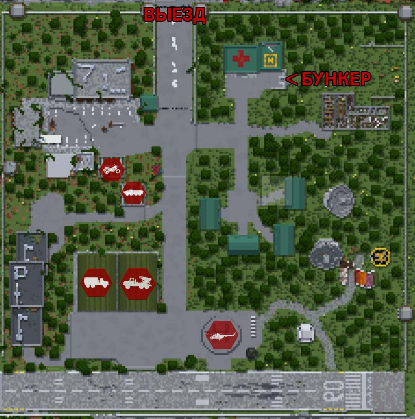
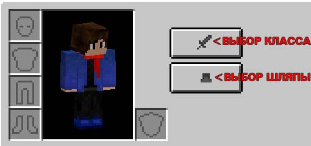
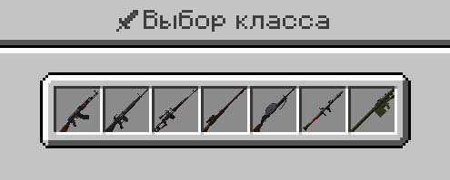
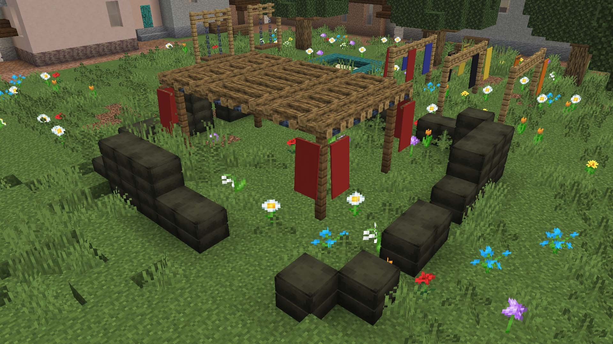
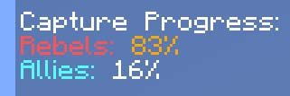
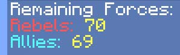

# Ход игры
2 команды начинают на своих **базах**.

На базе имеются:
1. Карта для телепортации на хабы
2. Сундук с предметами для установки хаба
3. Ангары с транспортом
4. Сундук с ракетами (наличие зависит от карты)

В инвентаре игрок может выбрать *класс* и *шляпу*. Также это можно сделать командами */class* и */hats*

**Классы**

В бункере на главной базе игрокам доступен выбор классов
Всего может быть 1 человек с уникальным классом на команду, кроме **стрелка**. **Стрелков** может быть бесконечное количество

**Шляпы**
Шляпы - предмет косметики

**Режим захвата города**

За установленные **хабы** в городе начисляются очки. За уничтожение **хаба** - снимаются.

Процентное соотношение **очков захвата** отображается **справа**.

Команда, у которой больше **очков захвата**, побеждает по истечении таймера.

Также есть второй способ победы - **резервы**:

**Резервы** - общие жизни команды
После смерти игрока тратится 1 резерв команды.
После траты всех **резервов** команда не может возрождаться. Команда проигрывает, если все оставшиеся игроки умрут.

После вывода сообщения о победе игра считается законченной.