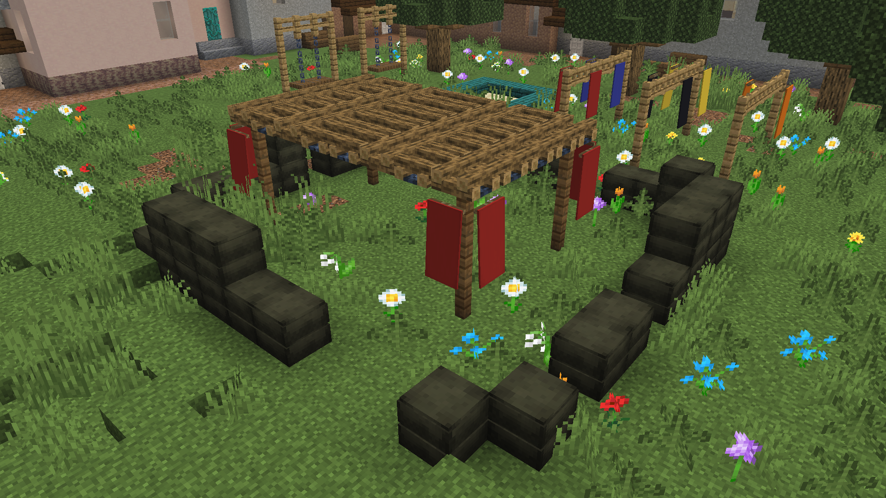

# Ход игры
2 команды начинают на своих **базах**.

<Картинка плана базы>

**Режим захвата города**

За установленные **хабы** в городе начисляются очки. За уничтожение **хаба** - снимаются.

Процентное соотношение **очков захвата** отображается **справа**.

<Сайдбар>

Команда, у которой больше **очков захвата**, побеждает по истечении таймера.

Также есть второй способ победы - **резервы**:
**Резервы** - общие жизни команды
После смерти игрока тратится 1 резерв команды.
После траты всех **резервов** команда не может возрождаться и проигрывает, если оставшиеся игроки умрут.
Также после траты всех **резервов** в центр карты скидываются **аирдропы**, которые может залутать любой игрок. С помощью них можно сбрасывать бомбу на место нажатия ПКМ.